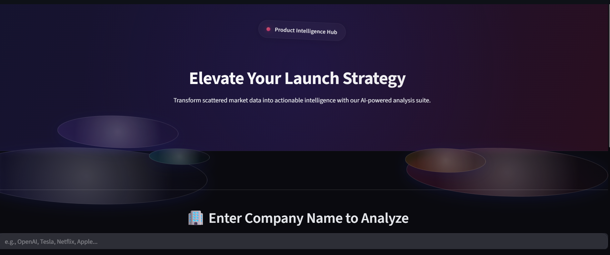

# 🚀 AI Product Launch Intelligence Agent


<p align="center">
	
</p>

> Tip: Save...

Concise, actionable competitive intelligence for product & GTM teams. This Streamlit app coordinates specialized AI analysts to gather public web data, synthesize findings, and produce executive-ready reports.

## Why this app helps
- Save days of manual research: automated collection + analysis from news, social, and public KPIs.
- Get consistent, evidence-backed recommendations for product launches.
- Produce downloadable reports (HTML/PDF) suitable for stakeholder briefings.

## Key features
- Multi-agent coordination: Competitor, Sentiment, and Metrics analysts work together for a complete view.
- Report generation: HTML and PDF exports with executive summary, KPIs, charts, and sources.
- Simple UX: Streamlit interface with sidebar for API keys and one-click analysis.

## Who should use it
- Product managers and launch teams
- Marketing and growth teams
- Founders and startup strategists
- Competitive intelligence & market research teams
- Investors and due-diligence analysts

## Quick start
1. Clone the repo and change into the agent folder:

```powershell
git clone <repo-url>
https://github.com/Mohamed-Noufal/product-launch-intelligence.git
```

2. (Optional) Create and activate a virtual environment:

```powershell
python -m venv venv
.\venv\Scripts\Activate.ps1
```

3. Install dependencies:

```powershell
pip install -r requirements.txt
```

4. Provide API keys (either `.env` or in-app sidebar).

5. Run the app:

```powershell
streamlit run app.py
```

Open http://localhost:8501, enter a company name, and click **Analyze All**.

## How to use (brief)
- Enter API keys in the sidebar.
- Type a company/product name and press **Analyze All**.
- Review the tabs for Competitor Analysis, Market Sentiment, and Performance Metrics.
- Generate a report from the Report Generation section (HTML/PDF/Raw text).

## How this benefits your team
- Faster decision speed: translate web signals into prioritized actions.
- Repeatable research: standardize how competitor intelligence is produced.
- Shareable outputs: exports for slides, memos, or board reports.

## How to improve the reports (next steps)
- Use the Jinja2 + WeasyPrint template (included) for high-fidelity, styled PDFs.
- Add registered fonts and a brand stylesheet to match corporate templates.
- Add more KPI cards and sparklines (small inline PNG charts) for instant trends.
- Create a TOC and bookmarks for long reports.
- Add caching and rate-limit backoff for robust crawling.
- Allow attaching CSV/JSON raw exports to reports for downstream analysis.

## Project layout (important files)
- `app.py` — Streamlit entrypoint and UI
- `agents/` — agent implementations and `team_coordinator.py`
- `services/report_generator.py` — report rendering (HTML/PDF)
- `templates/report.html` — Jinja2 template used by WeasyPrint
- `requirements.txt` — Python dependencies

## Contributing ideas
- Add industry-specific agents (fintech, healthcare, gaming).
- Improve fidelity: embed vector charts (SVG) or use Plotly for interactive previews.
- Automate scheduled reports (daily/weekly) and email delivery.

## Troubleshooting
- If PDF generation fails, install WeasyPrint and its native deps, or fall back to HTML output:

```powershell
pip install weasyprint jinja2
```

- If Streamlit CLI is not found: ensure venv is activated and `streamlit` is installed.

## License & contact
Use this project as a starting point for internal intelligence workflows. For questions, open an issue or send a short note describing your use case.

---

This README gives you a compact guide and next steps to make reports look professional and production-ready. If you want, I can now:
- Implement a finished example PDF using the included Jinja2 template and attach a `test_report.pdf` here (if WeasyPrint is available), or
- Continue improving the `services/report_generator.py` ReportLab path to match the template.
